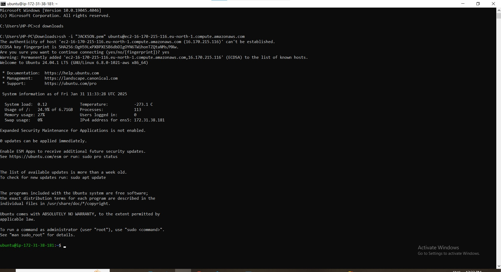
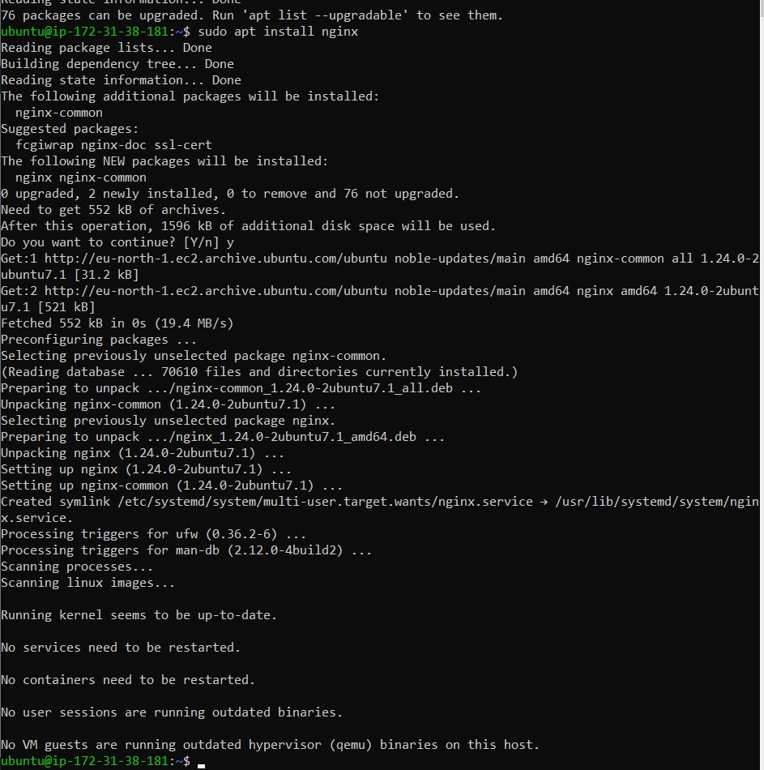
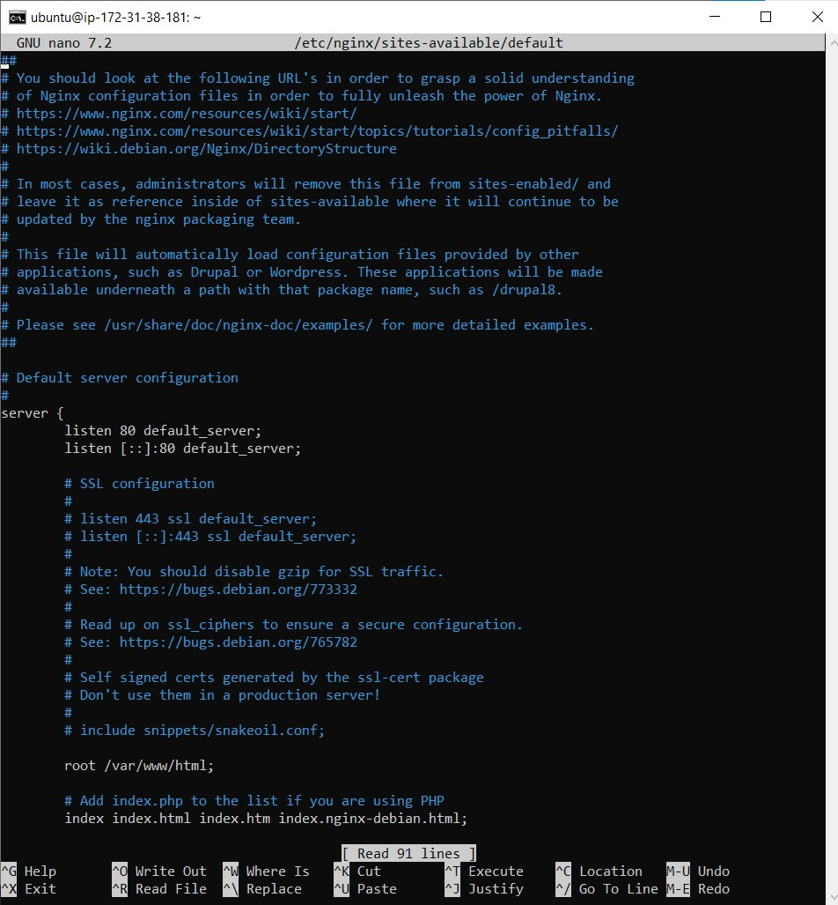
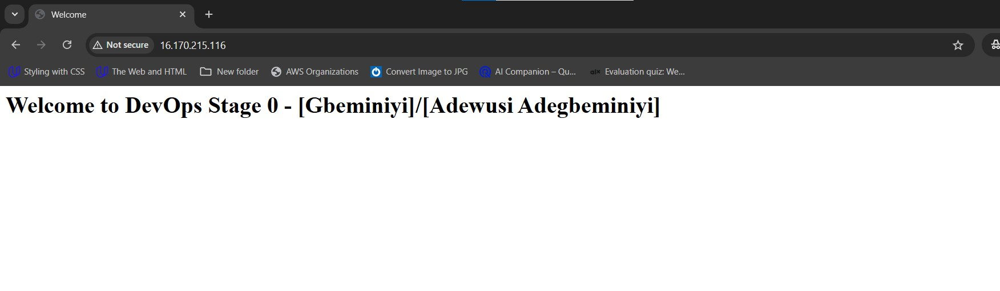

 # **NGINX CONFIGURATION GUIDE**

## **Introduction**

### **Project Overview**
This guide documents the step-by-step process to set up and configure NGINX on an Ubuntu server as part of the HNG Internship - DevOps Stage 0 task. It includes installation steps, configurations, challenges encountered, and solutions.

### **Technologies Used**
- **AWS EC2**: Provides the server infrastructure.
- **Ubuntu**: The operating system running on the EC2 instance.
- **Nginx**: Web server to serve the website.


## **Setup and Configuration**

### **1. AWS EC2 Instance Setup**

#### **Step 1: Launch an EC2 Instance**
- Log in to the AWS Management Console.
- Navigate to the EC2 Dashboard and click on **Launch Instance**.
- Select **Ubuntu Server 20.04 LTS** as the AMI (Amazon Machine Image).
- Choose an instance type, e.g., **t2.micro**.
- Configure instance details, such as network and storage settings, if needed.
- Review and launch the instance. During launch, create or select an existing key pair for SSH access.


#### **Step 2: SSH into your EC2 Instance**

#### **Step 1: Open a Terminal**
- Navigate to the directory where your `.pem` file is stored, using cd downloads.


#### **Step 2: SSH Command**
- Use the following command to connect to your instance:  **ssh -i "Jackson.pem" ubuntu@16.170.215.116**


  


###  **Install and Configure Nginx**

#### **Step 1: Update the System**
- Update the package lists:
- using the command **sudo apt update**

#### **Step 2: Install Ngin**x
- Install Nginx using the following command: **sudo apt install nginx**

#### **Step 3: Start and Enable Nginx**
- Start and Enable nginx with the command:
- **sudo systemctl start nginx**
- **sudo systemctl enable nginx**



### **Step4. 

### **4. Configure the Web Server**

#### **step 1:Open the Nginx configuration file and edit the default web page**
- using the command: **sudo nano /var/www/html/index.html** to open the nginx
- Add the following content:
```bash
echo '<!DOCTYPE html>
<html>
<head>
    <title>DevOps Stage 0</title>
</head>
<body>
    <h1>Welcome to DevOps Stage 0 - [Gbeminiyi]/[Adewusi Adegbeminiyi]</h1>
</body>
</html>' | sudo tee /var/www/html/index.html
```

- Restart Nginx using the command: **sudo systemctl restart nginx** to apply changes.


### **5.  Ensuring Correct NGINX Configuration**

#### **step 1: Check if NGINX is pointing to the correct directory**

- Using the command: **cat /etc/nginx/sites-available/default**
 
 #### ** step 2: Ensure root /var/www/html; is correctly set.
 - Using the command: **sudo nginx -t**
 - Restart the NGINX: Using the command **sudo systemctl restart Nginx**

 

### **6.  Testing and Verifying Deployment**

#### **step1: Access the browser using the internet**
- Using: http://<your-server-ip>/ (16.170.215.116)
 
 

 **Troubleshooting Common Issues**
 - Allow HTTP traffic: Using the command **sudo ufw allow 'Nginx Full'**, Ensure cloud provider security group allows inbound port 80.


 **Changes Not Reflecting**
 - Clear the browser cache and restart NGINX.

 **Learning Outcomes**
 - Web Server Deployment: Hands-on experience setting up and managing NGINX.
 - Linux Server Management: Configuring firewalls, troubleshooting errors, and managing services.
 - Cloud Infrastructure: Strengthened ability to work with AWS and cloud-based deployments.

 **Conclusion**
 This NGINX configuration task reinforced my skills in DevOps and cloud computing. Looking forward to more challenging tasks ahead! 🚀